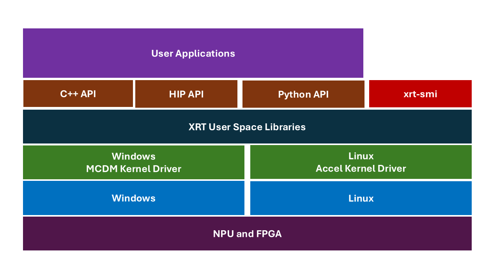

..
   comment:: SPDX-License-Identifier: Apache-2.0
   comment:: Copyright (C) 2019-2022 Xilinx, Inc. All rights reserved.
   comment:: Copyright (C) 2022-2026 Advanced Micro Devices, Inc. All rights reserved.

================
FleXible RunTime
================

.. image:: https://scan.coverity.com/projects/17781/badge.svg
    :target: https://scan.coverity.com/projects/xilinx-xrt-5f9a8a18-9d52-4cb2-b2ac-2d8d1b59477f

-------------------------------------------------------------------------------

FleXible RunTime (XRT) is implemented as a combination of user-space and kernel driver components, providing an 
abstracted runtime software interface for AMD NPUs and AMD FPGAs. It enables seamless access to NPUs on Ryzen-based 
client systems and Versal-based embedded platforms, as well as to programmable logic (PL) fabric on Versal, MPSoC, 
and Alveo platforms. XRT supports both Linux and Windows, running on x86_64 and aarch64 host architectures.

`XRT Header files <https://github.com/Xilinx/XRT/tree/master/src/runtime_src/core/include/xrt>`_

-------------------------------------------------------------------------------

`System Requirements <https://xilinx.github.io/XRT/master/html/system_requirements.html>`_

-------------------------------------------------------------------------------

`Build Instructions <https://xilinx.github.io/XRT/master/html/build.html>`_

-------------------------------------------------------------------------------

`Documentation xilinx.github.io/XRT <https://xilinx.github.io/XRT>`_

-------------------------------------------------------------------------------
